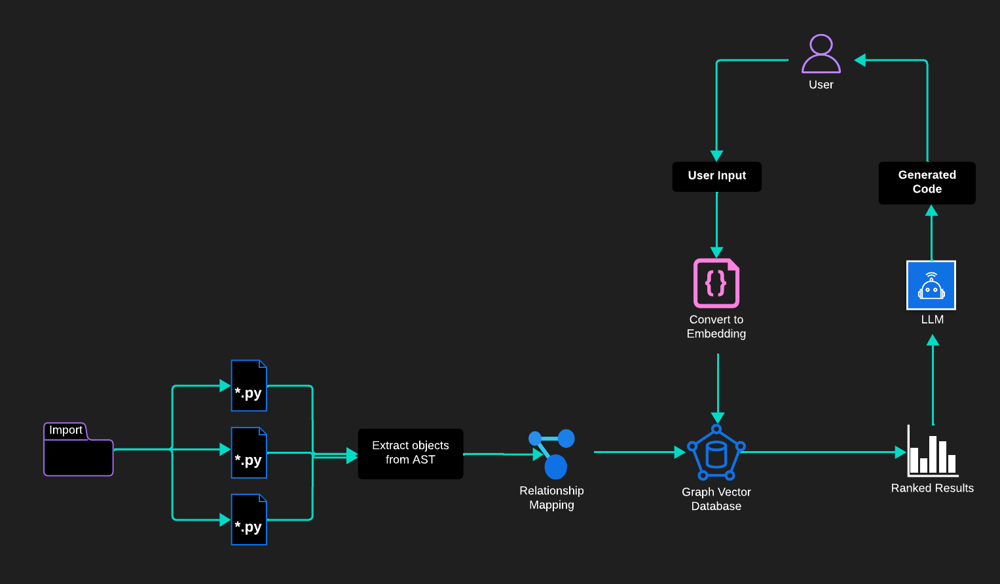

# Graph-CodeGen 🤖🧠

Welcome to Graph-CodeGen, a repository dedicated to exploring a novel technique for code generation using a Language Model (LLM). Our primary focus is on leveraging textual summaries of Python objects, including functions, classes, modules, and more. These summaries are used to provide precise results when searching for contextual information within a vector database. This information is then added to a prompt, thereby assisting the LLM in the code generation process.

## Overview 📝

The initial step involves a comprehensive analysis of the Abstract Syntax Tree (AST) of the code. The goal of this analysis is to identify and understand the connections between different objects. Following this, we create a summary for each relevant object and encapsulate it as a node within a graph network. We further enhance this node with metadata, including the source code, dependencies, and other pertinent information. When an object depends on another one outside of its local scope, an edge is drawn to connect the two.

This approach aims to improve the quality of code semantic search results in two main ways:

- By converting code objects into more easily digestible text summaries, we provide a more understandable alternative to the original code embedding.
- By mapping the relationships between various objects on a graph network, we enable the use of graph traversal algorithms.

This method not only could simplifies the understanding of the code by the LLM, but also makes it easier to reuse in different contexts, thereby boosting accuracy and mitigating the hallucination problem observed with Language Models.

## Technology Stack 📚

### CozoDB

https://www.cozodb.org/

CozoDB is a general-purpose, transactional, relational database that uses Datalog for query, is embeddable but can also handle huge amounts of data and concurrency, and focuses on graph data and algorithms. It supports time travel and it is performant!

### Jina Embeddings v2

https://huggingface.co/jinaai/jina-embeddings-v2-base-en

`jina-embeddings-v2-base-en` is an English, monolingual open-source embedding model supporting 8192 sequence length. It is based on a Bert architecture (JinaBert) that supports the symmetric bidirectional variant of [ALiBi](https://arxiv.org/abs/2108.12409) to allow longer sequence length.

### LangChain

https://www.langchain.com/

LangChain is a Python library and framework for developing applications powered by language models. It provides a standard interface to interact with a variety of large language models (LLMs) like GPT. LangChain includes functionality such as token management and context management1. It also features data awareness and agentic behavior, enabling the model to interact with its environment and make dynamic decisions based on user input. LangChain provides SDK to integrate with many LLMs provider, including Azure OpenAI.
